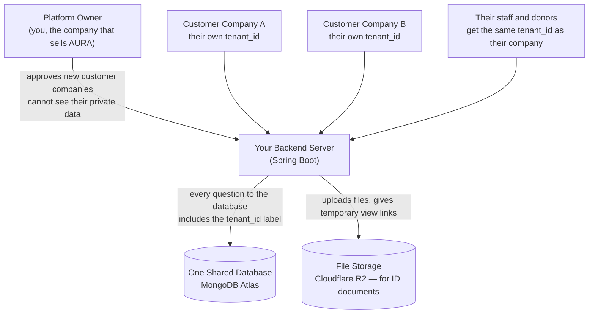
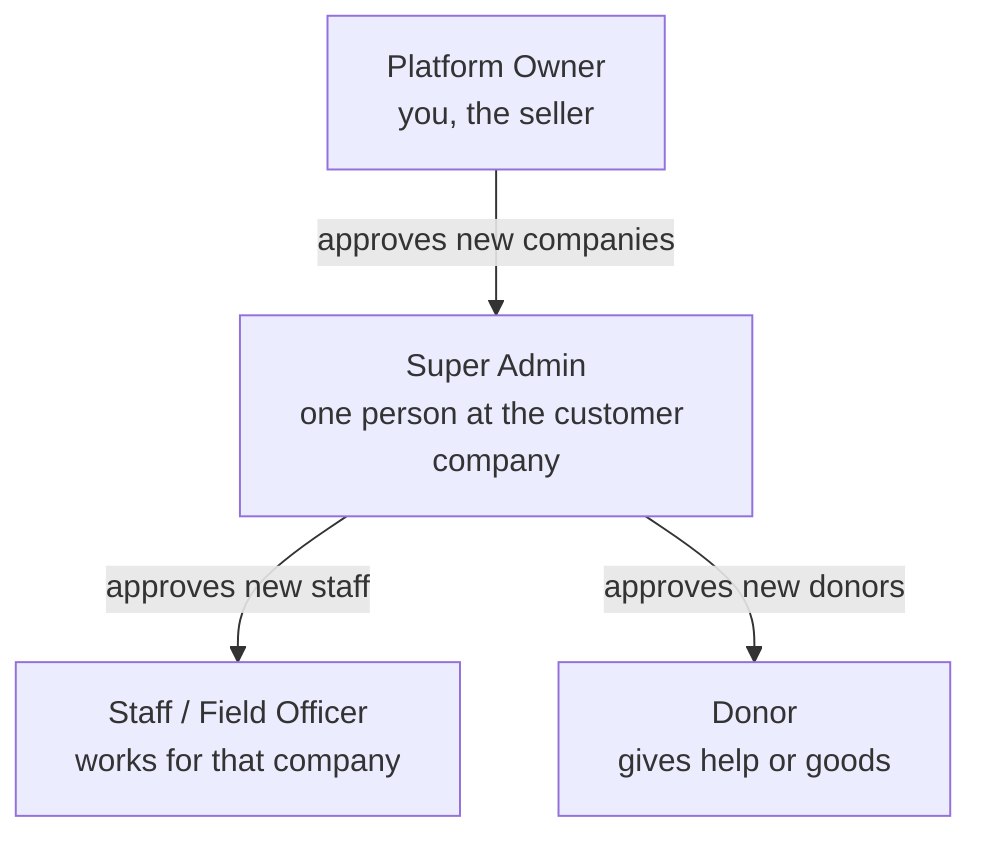
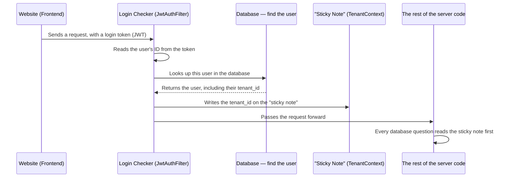
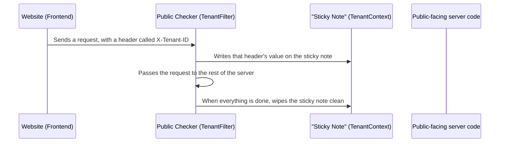
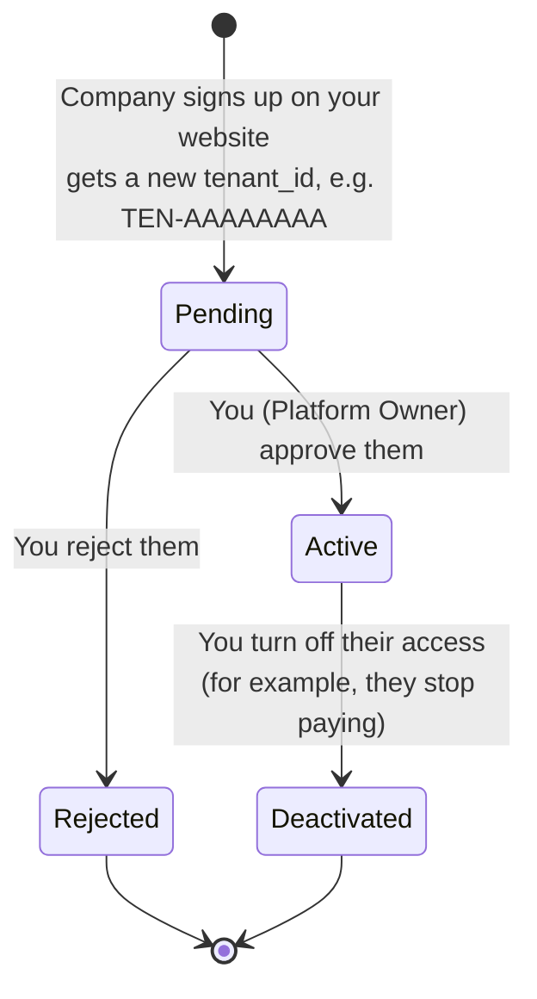
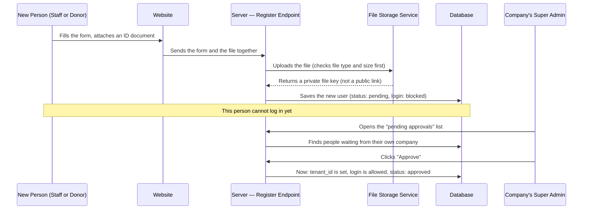
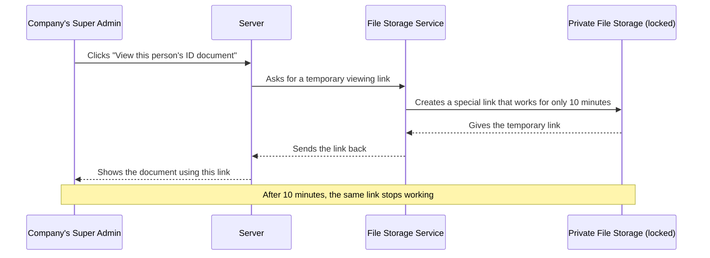
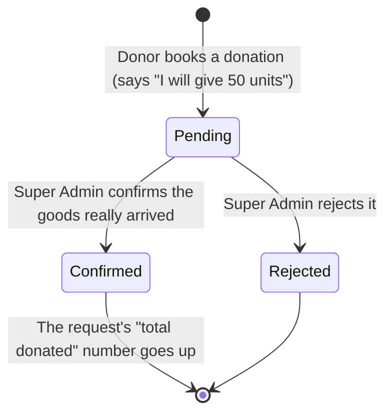
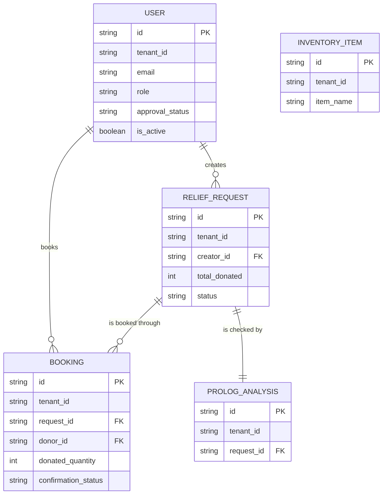

# AURA — How the System Works (Simple Guide for Selling to a Real Company)

> This document explains your system in simple English. It also gives advice for selling this product to a real organization, not just for a school project.
> The diagrams are made with a tool called Mermaid. They will show as nice pictures on GitHub, in VS Code (with the "Markdown Preview Mermaid Support" extension), or in apps like Obsidian. If you only see text with weird symbols, that just means your viewer cannot draw Mermaid pictures yet — the file is still correct.

---

## 1. The Big Idea — Explained Simply

Imagine you build a big storage warehouse. Many different companies put their boxes inside this same warehouse. Every box has a label on it. The label tells you which company owns that box.

This is exactly what your system does, but with data instead of boxes.

- The "warehouse" is your one shared database (MongoDB).
- The "boxes" are pieces of data — a user, a request for help, a donation, an item in stock.
- The "label" is a field called `tenant_id`. Every piece of data has this label.

There is **no physical wall** between Company A's data and Company B's data inside the warehouse. They sit in the same room. The only thing that keeps them separate is this: **every time your code asks the database for information, your code must always say "only show me boxes with this label."**

This is called **shared-database multi-tenancy**. It is a normal, accepted way to build software for many customers. Big companies like Slack and early Shopify used this same idea when they were smaller. It is the right choice for you too — it is cheap, it is simple, and MongoDB works well with it.

But there is one big risk you must always remember:

> **If your code forgets to add the label filter even ONE time, in ONE place, Company A might see Company B's private data.**

This is the single most important sentence in this whole document. Read it again before you write any new feature.

---

## 2. How the Whole System Is Built



In simple words:

- **You** are the Platform Owner. You run the whole platform. You approve new companies who want to use AURA. You **cannot** see their private documents or data — only that they exist and whether they paid you.
- **Each customer company** (let's call them "Organization A", "Organization B") is a **tenant**. They each get their own `tenant_id`, like `TEN-AAAAAAAA`.
- **All data sits in one database.** This saves you money — you do not need a separate server for every customer.
- **All files (like ID cards, NIC photos) sit in one private file storage.** Nobody can open these files directly. They need a special temporary link from your server first.

---

## 3. Who Can Do What



Think of it like a company with levels:

1. **Platform Owner (you)** — the top level. You decide which companies are allowed to use your software.
2. **Super Admin** — one person from the customer company. This is usually the manager who signed up to buy your software. They manage their own staff and donors.
3. **Staff / Field Officer** — works inside that one company. They cannot see anything from other companies.
4. **Donor** — a person who gives help (money or goods) through that one company's page.

Nobody can log in right away after signing up. Someone one level above them must first say "yes, I approve this person." This stops random people from registering and immediately seeing private data.

---

## 4. How the System Knows Which Company is Asking

This is the most technical part, but it is very important to understand, so let's go slowly.

There are two situations:

### Situation A: The person is already logged in



Think of the **JWT login token** like an ID card with an invisible barcode. When someone logs in, the server scans the barcode, looks up who they are, and finds out which company they belong to. The server then writes this company name on a "sticky note" (this is what programmers call `TenantContext`). Every other piece of code, for the rest of this one request, reads that sticky note before asking the database for anything.

### Situation B: Nobody is logged in yet (for example, the public registration page)



**Very important security rule**: if someone IS logged in, the server will always trust their login token, and will **completely ignore** the `X-Tenant-ID` header, even if it is sent. Why? Because anyone can open their browser tools and type any text they want into a header. A header is like a sticky note anyone can write on themselves — it cannot be trusted. A login token is signed and locked — nobody can fake it without your server's secret key. So the header is only ever trusted for people who are NOT logged in yet, because there is nothing else to check against.

One more small but smart detail: the "sticky note" code always gets wiped clean (`clear()`) after every single request finishes, no matter what happens. This matters because your server reuses the same worker threads for many different requests, one after another. If you forgot to wipe the sticky note, the next customer's request might accidentally read the wrong company's name left over from a previous request. Your plan already handles this correctly — good. Just know *why* it matters.

---

## 5. How a New Customer Company Signs Up



In plain words: a new company fills out a form on your website. They are given a `tenant_id` right away, but they **cannot log in yet**. You check them, and click "approve." Only then can their account be used. You can also turn a company off later — this is very useful for real business, for example, if they stop paying their subscription.

---

## 6. How a New Staff Member or Donor Signs Up (With Documents)



Notice this: when someone signs up, they do not choose their own `tenant_id`. **The Super Admin who approves them is the one who gives them their company's `tenant_id`.** This is smart and safe — a stranger cannot just pick "I belong to Company A" by themselves. Someone who is already trusted inside Company A must say "yes, this person is one of us" before the system writes that company's label onto them.

---

## 7. How Private Documents Are Viewed Safely



Think of this temporary link like a **wristband at a concert.** It is not a key that opens the door forever. It only works for a short time, and then it is useless, even if someone copies it or saves it. This is exactly how big companies like Amazon and Google handle private files — your plan is following the correct, modern way of doing this. This matters a lot now, because real documents (like NIC or ID card photos) are very sensitive personal information. Mishandling these could cause real legal trouble for your business, not just a bad grade.

---

## 8. How a Donation Gets Confirmed



This is on purpose **not automatic.** A donor saying "I will give 50 units" is just a promise. It does not mean the goods actually arrived. Only a real human — the Super Admin — clicking "Confirm" means somebody actually checked that the goods are really there. This protects both your customer companies and the people receiving help, because nobody can fake a donation just by clicking a button on their own. Keep this manual step. Do not let anyone convince you to automate it later without a very good reason.

---

## 9. The Data Model (What Information is Stored)



Look carefully: every single box in this picture has `tenant_id` at the top. This is not by accident. It is the whole idea of your system, shown in one picture. `id` (sometimes called `_id` in MongoDB) makes each single piece of data unique on its own. `tenant_id` is the separate label that says which company owns it.

---

## 10. Honest Technical Advice — Things to Fix Before You Sell This

I looked closely at your plan. The code is good and well thought out. But selling this to a real company is very different from showing it to a teacher. Real companies will trust you with real people's private information, and possibly pay you real money. Here is my honest list of things to check or fix, in order of importance:

1. **Write an automatic test that proves two companies cannot see each other's data — and run it every time you change the code.** This is more important than any other test. A manual check ("I clicked around and it looked fine") is not enough once real customers are using this. Write one test: create Company A, create Company B, try to read Company A's data while logged in as Company B, and make sure you get zero results. Run this test automatically every time before you publish a new update.

2. **Fix a small gap in your data-fixing script.** Your plan has a script (`DataMigrationService`) that adds the `tenant_id` label to old data that doesn't have one yet. But it does not also fix the `approval_status` field for old users who are already active. This means an old user might show up in your "waiting for approval" list, even though they can already log in. This is confusing, especially in front of a real customer during a demo. Fix: also set `approval_status` to `"approved"` for any user who is already marked active.

3. **The rule "company name is required only for Super Admins" is not actually being checked by the code.** Right now, nothing stops someone from leaving this field empty when they should not. Add a manual check in your code: if the role is `super_admin`, and the company name is empty, reject the registration with a clear error message.

4. **Be careful with one sentence in your own notes.** Your plan says keeping the Platform Owner away from customer data "is a legal requirement under GDPR." I am not a lawyer, and this is too strong a claim to make without checking. It is a good **privacy habit**, and you should absolutely keep doing it. But do not promise customers it satisfies a specific law unless an actual lawyer confirms that for your country and your customers' country.

5. **If your file storage (Cloudflare R2) will ever be opened directly by a web browser** (for example, showing an image directly with an `` tag instead of through your server), you need to turn on a setting called CORS in the R2 dashboard. Without it, browsers will block the file even if the temporary link is correct. This is a common and confusing problem if you don't know to look for it.

---

## 11. Business Advice — What You Need Before You Can Actually Sell This

This is the most important new section, because selling software to a real company is not just about good code. Companies will ask you questions you may not expect. Here is a simple checklist, explained in plain words. I am not a lawyer or a business advisor, so please treat this as a starting point, not final legal or financial advice — talk to a real lawyer or accountant before signing any contract for real money.

### 11.1 Legal paperwork you will likely need
- **Terms of Service** — a simple document that explains the rules of using your software.
- **Privacy Policy** — a document that explains what data you collect, why, and how you protect it. Very important, since you store ID documents.
- **A simple contract or agreement** with the company buying your software — what you promise to give them, what they pay, and what happens if something goes wrong.
- Check if there is a data protection law in the country where your customer operates (for example, Sri Lanka has its own Personal Data Protection Act). A short conversation with a lawyer about this single topic is worth the cost.

### 11.2 Backups and what happens if something breaks
- Turn on **automatic backups** in MongoDB Atlas. Do not rely only on your own memory of "I should back this up sometime."
- Decide and write down (even just for yourself): if the database is lost, how much data are you willing to lose? One hour? One day? This is called your "backup plan," and customers may ask about it.
- Test restoring a backup at least once, before you need it for real. A backup you have never tested might not actually work.

### 11.3 Keeping the system running and knowing when it breaks
- Add simple monitoring. Free tools like UptimeRobot can tell you (by email or SMS) the moment your website goes down — you do not want your customer to be the one telling you first.
- Add error logging. A free tool like Sentry can catch errors happening on your server in real time, so you can fix bugs before customers complain about them.

### 11.4 Payments and billing
- Your plan mentions the Platform Owner does "billing management," but the actual payment system is not built yet. Decide: will you charge a flat monthly fee per company? A fee per number of staff or donors? A free trial period?
- You will need a payment processor (for example, Stripe, PayHere if you are targeting Sri Lankan businesses, or a bank transfer process if you are starting very small and manually).
- Decide what happens automatically if a company stops paying — should their account become `Deactivated` automatically, or does a human need to check first? Right now this is a manual switch in your system; that is fine to start, but write down your own rule for when you will use it.

### 11.5 Support — helping your customer when something goes wrong
- Decide how a customer can reach you for help: an email address, a simple contact form, or a chat tool.
- Decide roughly how fast you will respond. You do not need a fancy guarantee at first — even "we reply within one business day" is a fair and honest starting promise.

### 11.6 Helping your customer understand the product
- Write a short, simple guide (separate from this technical document) for the Super Admin at each company — how to approve new staff, how to confirm a donation, how to view a document. Real customers are usually not technical people, so this guide should use plain language and pictures, similar to this document.

### 11.7 Letting your customer leave without a fight
- Decide and write down: if a company stops using your software, can they export their own data? This builds trust, even if a company never actually asks for it. A simple "export to Excel" button for their own data is enough for a first version.

### 11.8 Branding for each company (optional, but a strong selling point)
- Since you already separate each company by `tenant_id`, you are close to offering each company their own look — for example, `companya.yourapp.com` instead of everyone sharing one URL. This is called "white-labeling," and it is something companies are often willing to pay extra for. You do not need to build this immediately, but it is worth knowing your current design already supports it easily, because of the `tenant_id` system you already have.

---

## 12. If You Only Remember Five Things

1. **No wall inside the database keeps companies apart — your code is the wall.** Every single database question must include the `tenant_id` filter. Always.
2. **A login token is always trusted over a header**, because a header is just text anyone can fake, but a login token is signed and cannot be faked.
3. **A new person has no company label until someone above them approves them.** The label is given at approval time, not at sign-up time.
4. **Temporary file links are like wristbands, not keys** — they expire on purpose, and that is a feature, not a bug.
5. **Confirming a donation is done by a human on purpose** — a booking is just a promise, a confirmation means someone actually checked.

---

## 13. MongoDB Atlas — Moving Your Existing Data There

Your plan explains how to set up a brand-new, empty database on Atlas. But you have probably already been building and testing with MongoDB on your own computer (using a tool called Compass). Here is how to move the data you already have, not just start fresh:

```bash
# Step 1: Copy everything out of your local database into a folder
mongodump --uri="mongodb://localhost:27017/aura_db" --out=./aura_backup

# Step 2: Copy that folder into your new Atlas database
# (Get your real connection string from the "Connect" button in Atlas)
mongorestore --uri="mongodb+srv://aura-app-user:<password>@aura-cluster-0.xxxxx.mongodb.net/aura_db" ./aura_backup/aura_db
```

Using this method also copies your indexes automatically, so you do not need to manually recreate them afterward. If instead you use the simple "Export" and "Import" buttons inside Compass, those only copy the data itself, not the indexes — in that case, remember to manually run your index-creation commands again afterward.

**Small checklist before going live on Atlas:**
- In **Network Access**, add the IP address of wherever your server lives. Do not leave it open to "anyone" (`0.0.0.0/0`) once you are running for real customers — that setting is only safe for early testing.
- Turn on Atlas's automatic backups (see section 11.2 above) — this matters much more now than during a school project, because real customer data is now involved.
- Double check your connection string changed correctly everywhere in your code — from `mongodb://localhost:27017/...` to the new `mongodb+srv://...` address. A common mistake is forgetting one leftover place where the old address is still written.
